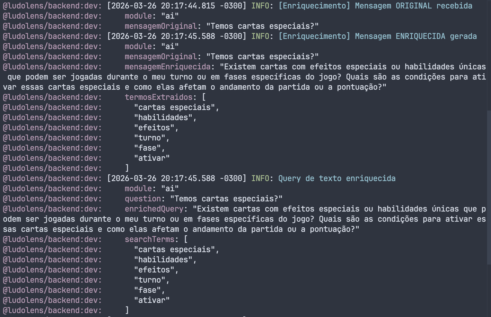

# Desvendando o LudoLens: Uma Jornada de Aprendizado em IA e Engenharia de Software

## 1. Introdução: O Propósito Educacional
O **LudoLens** transcende a definição de uma simples aplicação; é um microcosmo dos desafios da engenharia moderna, forjado no contexto do meu MBA em Engenharia de Software com IA.

* **O Problema:** A interrupção da imersão em jogos de tabuleiro para consultar regras complexas.
* **A Solução:** Um assistente de IA **Multimodal** que "vê" o tabuleiro (fotos) e "lê" o manual (RAG), respondendo dúvidas em tempo real.
* **O Objetivo:** Servir como laboratório prático para aplicar conceitos avançados de IA e Arquitetura de Software.

## 2. Arquitetura: Construindo para Ensinar
A arquitetura foi desenhada com foco na clareza didática e na eficiência.

### 🏗️ O Monorepo (Turborepo + Yarn Workspaces)
Decisão estratégica para impor consistência e reduzir a sobrecarga cognitiva. Tratar frontend e backend como um sistema único facilita a colaboração e a visibilidade.

### ⚙️ Anatomia do Backend (Separação de Responsabilidades)
A estrutura de pastas (`apps/backend`) reflete princípios sólidos de design:
* `controllers/`: **A Fronteira.** Traduz HTTP para comandos da aplicação.
* `services/`: **O Coração.** Onde vivem as regras de negócio puras.
* `agents/`: **O Cérebro da IA.** Isolamento estratégico da lógica volátil de LLMs (Prompts, Chains).
* `infra/`: **O Alicerce.** Configurações de banco e ambiente.

## 3. Tech Stack: Ferramentas e Aprendizados
Cada ferramenta foi escolhida para maximizar o aprendizado e a performance.

| Tecnologia | Função | Aprendizado Chave |
| :--- | :--- | :--- |
| **Hono** | API Framework | Arquitetura *Edge-ready*, ultrarrápida e preparada para o futuro serverless. |
| **Gemini 2.0 Flash** | LLM Multimodal | Capacidade de processar texto e imagem simultaneamente no pipeline. |
| **LangChain** | Orquestração | Gerenciamento do fluxo complexo de RAG e memória de conversação. |
| **PostgreSQL + pgvector** | Vector Store | Pragmatismo: usar infraestrutura robusta e conhecida para vetores. |
| **React 19 + Vite** | Frontend | *Developer Experience* ágil e uso de APIs modernas do React. |
| **Shadcn UI** | Interface | Construção de UI acessível e customizável com Tailwind v4. |

## 4. O Coração da IA: Fluxo RAG Multimodal
A maior complexidade técnica reside no pipeline de *Retrieval-Augmented Generation*. O sistema não apenas busca texto, mas contextualiza com a visão do tabuleiro.

### Aprendizado Prático:
> *"Um RAG eficaz depende menos do LLM em si e mais do pipeline de dados que o alimenta. O verdadeiro desafio reside na orquestração."*

---

## 5. Evolução do Projeto: Próximas Mudanças

Esta seção documenta as melhorias incrementais aplicadas ao LudoLens como parte da evolução contínua do projeto estudantil.

### 🧠 Prompt Enrichment

A técnica de **Prompt Enrichment** (Enriquecimento de Prompt) foi incorporada ao pipeline para elevar a qualidade das respostas geradas pelo LLM. Em vez de enviar a pergunta do usuário diretamente ao modelo, o sistema agora **enriquece o prompt** com contexto adicional antes da chamada à LLM.

* **O que muda:** A pergunta bruta do usuário passa por uma etapa intermediária que injeta informações relevantes — como contexto do jogo atual, histórico da conversa e trechos recuperados do manual — diretamente no prompt.
* **Por que importa:** Prompts mais ricos e bem estruturados reduzem alucinações, melhoram a precisão das respostas e permitem que o modelo raciocine com mais contexto, sem depender apenas do seu conhecimento interno.
* **Aprendizado:** A qualidade da saída de um LLM é diretamente proporcional à qualidade da entrada. Investir no pré-processamento do prompt é tão crítico quanto a escolha do modelo.

### Aprendizado Prático:
> *"Prompt Enrichment não é apenas uma otimização — é uma mudança de mentalidade: tratar o prompt como um artefato de engenharia, não como uma simples string."*

---
*Desenvolvido com ❤️ para a comunidade de board games e engenharia de software.*
